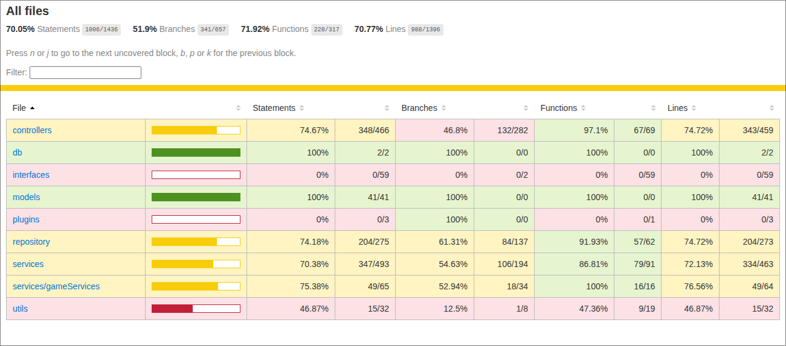

# UNO - Digital Card Game

This project is a digital implementation of the popular card game "UNO". The application allows multiple players to join a game session and play against each other following the classic UNO rules.

## Features

-   **Multiplayer:** Support for multiple players in the same game.
-   **Game Logic:** Implementation of UNO rules, including special cards (Skip, Reverse, Draw Two, Wild, Wild Draw Four).
-   **RESTful API:** Endpoints to manage players, games, and game actions.
-   **Functional Programming:** The code is structured following functional programming principles.

## Tech Stack

-   **Backend:** Node.js, Express.js
-   **Database:** MySQL with Sequelize ORM
-   **Authentication:** JWT (JSON Web Tokens) for secure sessions.
-   **Testing:** Jest and Supertest for unit and integration tests.

## Getting Started

Follow these instructions to get a local copy of the project up and running.

### Prerequisites

-   Node.js (version 18 or higher)
-   npm
-   MySQL

### Installation

1.  Clone the repository:
    ```sh
    git clone <REPOSITORY_URL>
    ```
2.  Navigate to the project directory:
    ```sh
    cd project_capstone_progra4
    ```
3.  Install the dependencies:
    ```sh
    npm install
    ```
4.  Set up the environment variables. Create a `.env` file in the project root and add the following variables (adjust the values according to your local setup):
    ```
    DB_HOST=localhost
    DB_USER=root
    DB_PASSWORD=your_password
    DB_NAME=uno_db
    JWT_SECRET=your_jwt_secret
    ```

### Running the Application

A `start` script was not found in `package.json`. You can start the server with:

```sh
node app.js
```

The server will start on the port you have configured.

### Running Tests

To run the test suite and see the coverage, execute:

```sh
npm test
```

## Project Structure

```
/
├── controllers/      # Controllers (route logic)
├── db/               # Database configuration
├── middlewares/      # Express middlewares
├── models/           # Sequelize data models
├── routes/           # API route definitions
├── services/         # Business logic and services
├── test/             # Tests (unit and integration)
├── utils/            # Utility functions
├── app.js            # Application entry point
├── package.json      # Dependencies and scripts
└── README.md         # This file
```

## Exam solution
In this Readme, you can find information about the project as well as the midterm presentation. The link to the demo video shows:
- The player CRUD works.
- The game CRUD works.
- The live execution of the tests is shown.
- The coverage percentage for each file is shown.

[LINK DEMO](https://drive.google.com/file/d/1WyzvowhwblTLcdeMX95OAbBkJH3zHBGb/view?usp=sharing)


## Collection of requests in Postman
[Collection Postman](https://www.postman.com/martian-equinox-934588/workspace/capstone-progra4/collection/23074740-8a289d5a-57cf-434f-b8c5-4dd8865bda2a?action=share&source=copy-link&creator=23074740)

## Image web


---

## SOLID Principles

### Single Responsibility Principle (SRP)

The Single Responsibility Principle (SRP) was applied by splitting the `gameService` class, which originally handled multiple responsibilities, into four specialized services:

* `GameCreationService`: Handles only the creation of new games.
* `GameGetService`: Manages retrieving data for a specific game or for all games.
* `GameStatusService`: Manages the different states of games, including starting and ending games.
* `GameUpdateService`: Handles updating data for existing games and performing partial deletions or changes.

This separation allows each class to have a single responsibility, making it easier to read, maintain, and test the code, and preventing a change in one feature from affecting others.

---

### Open/Closed Principle (OCP)

The open/closed principle states that code should be open to **extensions** but closed to **modifications**.
In this project, `gameLimit.js` exemplifies this principle: it allows time limits to be added to games without modifying the existing logic of services or models. If a new type of limit or rule were to be implemented, it could be done through new functions or methods without altering the original code. This ensures a **clean, scalable, and maintainable** design.

---

### Liskov Substitution Principle (LSP)

LSP indicates that objects of a subclass should be able to replace those of its superclass without altering the program's functionality.
In this case, `gameFast.js` represents a specialized type of game that follows the same structure as `game` and can override behaviors, such as player limits or game time. Thanks to this, services that operate on `game` can use `gameFast` without additional changes, maintaining system compatibility and consistency.

---

### Interface Segregation Principle (ISP)

ISP recommends small, specific interfaces, avoiding forcing classes to implement methods they don't use.
Here, it is implemented through the `IGameRepository` interface, which defines only the methods that services need to interact with the database (create, retrieve, update, delete games, etc.). This allows each service to depend only on the methods it actually uses, achieving more modular, readable, and maintainable code.

---

### Dependency Inversion Principle (DIP)

DIP establishes that classes should depend on abstractions, not concrete implementations.
The services (`GameCreationService`, `GameGetService`, `GameStatusService`, `GameUpdateService`) depend on the `IGameRepository` interface and not on the concrete `GameRepository` class. This allows the implementation of data persistence to be changed (for example, using another database or a mock for testing) without modifying the services, increasing the flexibility, scalability, and testability of the system.

---

### Unit Test



### Using Monads
The Monad pattern is used to handle errors in the application. In particular, the `Either` monad is used to encapsulate successful and failed outcomes. This pattern is useful because it allows errors to be propagated in a controlled manner through the call chain, which simplifies exception handling and improves code clarity.